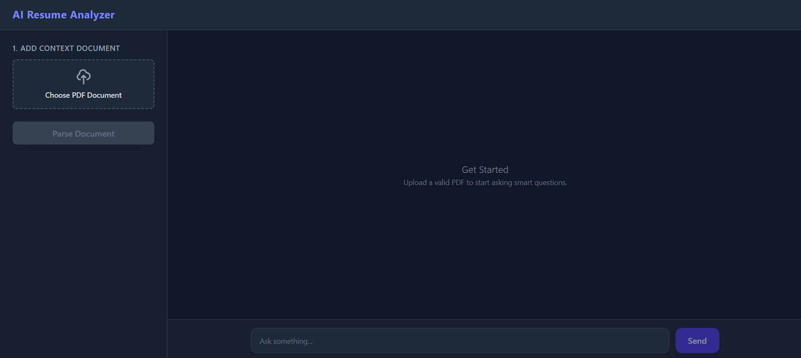

# AI Resume Analyzer

An AI-powered application that analyzes resumes using Generative AI and Retrieval-Augmented Generation (RAG). It helps evaluate, summarize, and extract key insights from resumes using local LLMs via Ollama.


## Screenshots




## Tech Stack
* Angular 22
* Python (FastAPI)
* Ollama
* RAG
* Vector Database (Chroma)
* Tailwind CSS


## Project Architecture

Angular Frontend
       │
       ▼
FastAPI Backend (Python)
       │
       ▼
RAG Pipeline (Document Processing + Embeddings)
       │
       ▼
Vector Database (Chroma)
       │
       ▼
Ollama (Local LLM)
       │
       ▼
AI Generated Resume Insights


## Getting Started

### Prerequisites

* Python 3.12
* Angular CLI
* Ollama

### Clone Repository

```bash
1. git clone https://github.com/sikanderx/ai-resume-analyzer.git
2. cd frontend
3. npm i
4. ng serve
```
Navigate to backend folder:

```bash
1. cd backend
2. npm i
3. npm run dev
```


The API will run on: http://localhost:8000


## Ollama Setup

Install Ollama from:

https://ollama.com

Run a model locally:

```bash
ollama run llama3
```

Ensure Ollama is running before starting the application.

## Learning Outcomes

This project helped in understanding:

* Full-stack AI application development
* Angular 22 frontend architecture
* FastAPI backend development
* REST API development
* RAG-based AI pipelines
* Vector database usage (FAISS / Chroma)
* Local LLM integration using Ollama
* Real-world resume analysis systems
* AI-powered application architecture
* Prompt-based conversational interfaces


## License

This project is open-source and available under the MIT License.
